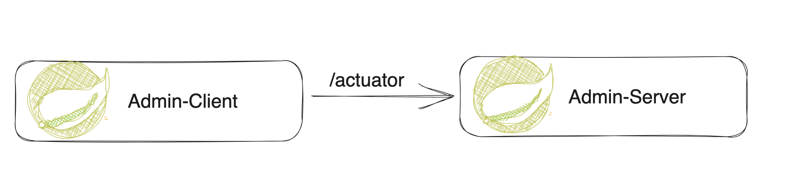

# Spring Boot 3 Actuator + Admin Demo

This is a demo project of Spring Boot 3 integration with Spring Admin

## Architecture


## Tech Stack
+ Spring Boot 3
+ Spring Actuator
+ Spring Admin
+ Lombok
+ Maven

## How to Setup

Git clone this repo, the run `mvn clean install`.

After, start 2 applications accordingly.


## Learning Note

`Spring Boot Admin` is a community project that provides a user interface and various tools to manage and monitor Spring Boot applications. It leverages Spring Boot's Actuator endpoints to gather and display information about the running applications. It typically consists of a server application, where the UI and logic are hosted, and client applications that are being monitored.


### Key Features

+ `Dashboard`: Provides a web-based UI to monitor the status and health of multiple Spring Boot applications.
+ `Health Monitoring`: Aggregates health checks from all registered applications and displays them in a consolidated view.
+ `Metrics`: Shows various metrics like memory usage, CPU usage, and other performance-related data.
+ `Logfile Access`: Allows access to log files of the monitored applications directly from the UI.
+ `JMX Beans`: Provides information about JMX beans and their attributes and operations.
+ `Thread Dump`: Enables capturing and viewing thread dumps for debugging purposes.
+ `Environment Variables`: Displays the environment variables and properties of the monitored applications.
+ `Notifications`: Can be integrated with various notification systems like Slack, Email, PagerDuty, etc., to alert on changes in the status of applications.


### How to integrate

For Admin Server, just 2 steps

1. add `spring-boot-admin-starter-server` dependency
   ```xml
        <dependency>
            <groupId>de.codecentric</groupId>
            <artifactId>spring-boot-admin-starter-server</artifactId>
        </dependency>
   ```
2. add annotation on main class
    ```java
    @SpringBootApplication
    @EnableAdminServer
    public class AdminServerApplication {
    
        public static void main(String[] args) {
            SpringApplication.run(AdminServerApplication.class, args);
        }
    }
    
    ```
   
For clients who want to managed by admin server, 2 steps: 
1. add actuator and admin client dependencies
    ```xml
    <dependency>
        <groupId>de.codecentric</groupId>
        <artifactId>spring-boot-admin-starter-client</artifactId>
    </dependency>
    <dependency>
        <groupId>org.springframework.boot</groupId>
        <artifactId>spring-boot-starter-actuator</artifactId>
    </dependency>
    ```
   
2. config actuator endpoints and admin server address
    ```yaml
    # To expose specific actuator endpoints
    spring:
      application:
        name: ADMIN-CLIENT
      boot:
        admin:
          client:
            url: http://localhost:8082
            enabled: true
            auto-registration: true
            instance:
              name: ${spring.application.name:JSS}
    
    management:
      endpoint:
        health:
          show-details: always
        metrics:
          enabled: true
    
      endpoints:
        web:
          exposure:
            include: '*'
          base-path: /actuator
    ```